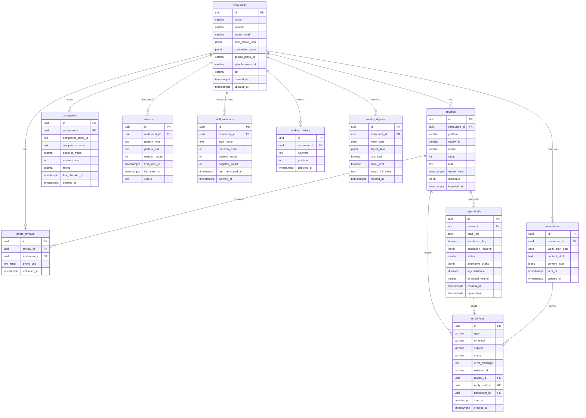

# ReviewReply Database Schema

## Overview

PostgreSQL database hosted on Supabase. 11 tables total covering review management, AI reply generation, competitor intelligence, and weekly reporting.

## ERD Diagram

## Table Descriptions

### Core Tables (Phase 1)
| Table | Purpose |
|-------|---------|
| `restaurants` | Restaurant accounts, brand voice config, platform credentials |
| `reviews` | Ingested reviews from Google, Yelp, etc. |
| `reply_drafts` | AI-generated reply drafts with escalation detection |
| `newsletters` | Weekly competitor intelligence newsletters |
| `email_logs` | Audit log for all outbound emails |

### Intelligence Tables (Phase 2)
| Table | Purpose |
|-------|---------|
| `competitors` | Tracked competitor restaurants with ratings/review counts |
| `patterns` | Recurring themes detected in reviews (complaints, praise, dish mentions) |
| `staff_mentions` | Staff member mentions with sentiment tracking |
| `photo_reviews` | Photos associated with reviews |
| `ranking_history` | Keyword ranking position history for SEO tracking |
| `weekly_digests` | Weekly intelligence digest reports with magic link access |

## Relationships

- All Phase 2 tables reference `restaurants(id)` with `ON DELETE CASCADE`
- `photo_reviews` also references `reviews(id)` with `ON DELETE CASCADE`
- `weekly_digests.magic_link_token` is `UNIQUE` for secure public access

## Index Strategy

| Index | Table | Columns | Purpose |
|-------|-------|---------|---------|
| `idx_competitors_restaurant` | competitors | restaurant_id | Filter by restaurant |
| `idx_patterns_restaurant` | patterns | restaurant_id, status | Active patterns lookup |
| `idx_staff_mentions_restaurant` | staff_mentions | restaurant_id | Staff by restaurant |
| `idx_photo_reviews_restaurant` | photo_reviews | restaurant_id | Photos by restaurant |
| `idx_ranking_history_restaurant` | ranking_history | restaurant_id, checked_at DESC | Recent rankings |
| `idx_weekly_digests_restaurant` | weekly_digests | restaurant_id, week_start DESC | Recent digests |

## Migrations

| File | Description | Date |
|------|-------------|------|
| `schema.sql` | Initial schema (5 tables) | 2026-02-10 |
| `migrations/002_add_intelligence_features.sql` | Phase 2 intelligence tables (6 tables) | 2026-02-11 |

## Service Layer

`src/services/database.js` provides:
- CRUD operations for all tables
- `competitors`, `patterns`, `staffMentions`, `photoReviews`, `rankingHistory`, `weeklyDigests`
- Complex queries via `queries.getDashboard()` and `queries.getReviewsWithPhotos()`
- Transaction helper via `withTransaction()`
